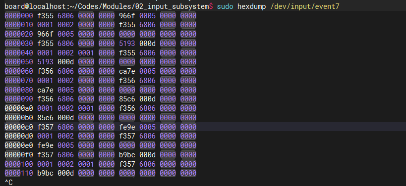

# 1. input设备驱动编写步骤

注意：这里使用定时器实现每隔一段时间上报事件，模拟实际事件上报情况。

适用的linux内核版本： linux 4.19.232

## 1.1. 创建 `input_dev` 结构体变量

使用`input_allocate_device()`函数

## 1.2. 初始化 `input_dev` 结构体变量

类型可以通过`__set_bit`函数来设置。

### 1.2.1 设置事件类型

在 kernel/include/dt-bindings/input/rk-input.h 文件中已经有Linux帮我们定义好的事件类型，
如下：

```c
/*
 * Event types
 */

EV_SYN	/* 用于同步事件，表示一组输入事件的结束 */
EV_KEY	/* 用于按键事件，表示按下、释放或重复一个键 */
EV_REL	/* 用于相对位移事件，表示设备的相对位置变化，如鼠标的移动 */
EV_ABS	/* 用于绝对位移事件，表示设备的绝对位置变化，如触摸屏的坐标 */
EV_MSC	/* 用于杂项事件，包含一些特殊目的的事件类型，例如设备状态变化等 */
EV_SW	/* 用于开关事件，表示开关的状态变化，如电源按钮、开合盖等 */
EV_LED	/* 用于LED事件，表示LED的状态变化 */
EV_SND	/* 用于声音事件，表示声音的播放相关事件 */
EV_REP	/* 用于重复事件，表示键盘重复发送事件 */
EV_FF	/* 用于力反馈事件，表示力反馈设备的输出事件 */
EV_PWR	/* 用于电源事件。表示电源状态变化 */
EV_FF_STATUS /* 用于力反馈状态事件，表示力反馈设备的状态变化 */
EV_MAX		/* 输入事件类型的最大值 */
EV_CNT		/* 输入事件类型的数量 */
```

### 1.2.2 设置具体类型

在 kernel/include/dt-bindings/input/rk-input.h 文件中已经有Linux帮我们定义好的。部分内容如下所示：

```c
/*
 * Keys and buttons
 *
 * Most of the keys/buttons are modeled after USB HUT 1.12
 * (see http://www.usb.org/developers/hidpage).
 * Abbreviations in the comments:
 * AC - Application Control
 * AL - Application Launch Button
 * SC - System Control
 */

#define KEY_RESERVED		0
#define KEY_ESC			1
#define KEY_1			2
#define KEY_2			3
#define KEY_3			4
#define KEY_4			5
#define KEY_5			6
#define KEY_6			7
#define KEY_7			8
#define KEY_8			9
#define KEY_9			10
#define KEY_0			11
#define KEY_MINUS		12
#define KEY_EQUAL		13
#define KEY_BACKSPACE		14
#define KEY_TAB			15
#define KEY_Q			16
```

## 1.3. 注册`input_dev`结构体变量

使用`input_register_device()`函数。

## 以上步骤得到的结果


可以看到：`/dev/input`下会自动生成`event7`。

通过下面的命令，可以查看是不是我们所设置的设备名称。


## 1.4. 上报事件

事件类型：type

具体事件：code

值：value

具体事件是与事件类型具体对应的。具体事件有其对应的值。这三个的关系是多对多。

每个事件类型都有对应的上报事件函数，如下：
```c
static inline void input_report_key(struct input_dev *dev, unsigned int code, int value)
{
	input_event(dev, EV_KEY, code, !!value);
}

static inline void input_report_rel(struct input_dev *dev, unsigned int code, int value)
{
	input_event(dev, EV_REL, code, value);
}

static inline void input_report_abs(struct input_dev *dev, unsigned int code, int value)
{
	input_event(dev, EV_ABS, code, value);
}

static inline void input_report_ff_status(struct input_dev *dev, unsigned int code, int value)
{
	input_event(dev, EV_FF_STATUS, code, value);
}

static inline void input_report_switch(struct input_dev *dev, unsigned int code, int value)
{
	input_event(dev, EV_SW, code, !!value);
}

```

上报完事件后，通知事件上报完成，使用以下函数：

```c
static inline void input_sync(struct input_dev *dev)
{
	input_event(dev, EV_SYN, SYN_REPORT, 0);
}
```

编译驱动，运行后，输出节点的信息，如下所示：


# 2. 编写应用程序获取驱动层上报的数据

驱动程序在上报数据时，上报的数据包的结构如下：

```c
struct input_event {
#if (__BITS_PER_LONG != 32 || !defined(__USE_TIME_BITS64)) && !defined(__KERNEL__)
	struct timeval time;
#define input_event_sec time.tv_sec
#define input_event_usec time.tv_usec
#else
	__kernel_ulong_t __sec;
#if defined(__sparc__) && defined(__arch64__)
	unsigned int __usec;
	unsigned int __pad;
#else
	__kernel_ulong_t __usec;
#endif
#define input_event_sec  __sec
#define input_event_usec __usec
#endif
	__u16 type;
	__u16 code;
	__s32 value;
};
```

具体程序查看`jason_input_app.c`

# 3. 输入子系统上报的数据格式分析

time.tv_sec，time.tv_usec 的类型时long int，占8个字节;

__u16 type 的类型时unsigned short int，占2个字节;

__u16 code 的类型时unsigned short int，占2个字节;

__s32 value 的类型时unsigned int，占4个字节;

所以，一个 input_event 数据包所占字节的大小为：`8 + 8 + 2 + 2 +4  = 24`个字节。如下图所示，划红线的为一个数据包：


成员的值如下：

time.tv_sec：fef8 6806 0000 0000 

time.tv_usec：a28a 0008 0000 0000

type：0001 

code：0002 

value：0000 0000

可以看出与驱动程序中上报的数据包数据一致。

# 4. 通用事件处理层驱动分析

## 4.1 evdev_handler的注册过程：

```c
static struct input_handler evdev_handler = {
	.event		= evdev_event, // 单个事件处理函数
	.events		= evdev_events, // 多个事件处理函数
	.connect	= evdev_connect, // 当input_dev 和 input_handler 匹配成功后去执行的函数
	.disconnect	= evdev_disconnect, // 断开连接函数
	.legacy_minors	= true, // 设置为true，表示使用传统的次设备号分配方式，如果为false，则使用动态的次设备号分配方式
	.minor		= EVDEV_MINOR_BASE, // 次设备号的起始值
	.name		= "evdev", // 名称
	.id_table	= evdev_ids, // 匹配表，即匹配规则
};

static int __init evdev_init(void)
{
	return input_register_handler(&evdev_handler);
}

static void __exit evdev_exit(void)
{
	input_unregister_handler(&evdev_handler);
}
```

## 4.2 evdev 和 evdev_client 结构体

```c
struct evdev {
	int open; // 表示 evdev 设备是否处于打开状态。如果为非零值，表示设备以打开；如果为零，表示设备未打开。
	struct input_handle handle; // 表示 handler 和 dev 的连接
	wait_queue_head_t wait;
	struct evdev_client __rcu *grab;
	struct list_head client_list;
	spinlock_t client_lock; /* protects client_list */
	struct mutex mutex;
	struct device dev; // 设备模型。设备
	struct cdev cdev;
	bool exist; // 表示 evdev 设备是否存在。如果为 true，表示设备存在并可用；如果为false，表示设备不存在或不可用。
};

/* evdev_client 用来表示一个 evdev 客户端。在应用程序中每打开一遍 event 设备节点，就会用一个 evdev_client 结构体来表示。通过这个结构体，系统可以为每个 evdev 设备维护多个客户端，并管理每个客户端的状态和属性。 */
struct evdev_client {
	unsigned int head; 
	unsigned int tail;
	unsigned int packet_head; /* [future] position of the first element of next packet */
	spinlock_t buffer_lock; /* protects access to buffer, head and tail */
	struct fasync_struct *fasync;
	struct evdev *evdev;
	struct list_head node;
	unsigned int clk_type;
	bool revoked;
	unsigned long *evmasks[EV_CNT];
	unsigned int bufsize;
	struct input_event buffer[];
};
```

## 4.3 input_register_handler函数

```c
int input_register_handler(struct input_handler *handler)
{
	struct input_dev *dev;
	int error;

	error = mutex_lock_interruptible(&input_mutex);
	if (error)
		return error;

	INIT_LIST_HEAD(&handler->h_list);

    // 将 handler 放在 input_handler_list 链表中
	list_add_tail(&handler->node, &input_handler_list);

    // 取出 input_dev 和新注册的 handler 进行匹配， 匹配成功执行connect函数
	list_for_each_entry(dev, &input_dev_list, node)
		input_attach_handler(dev, handler);

	input_wakeup_procfs_readers();

	mutex_unlock(&input_mutex);
	return 0;
}
EXPORT_SYMBOL(input_register_handler);
```

## 4.4 evdev_connect 函数

```c
static int evdev_connect(struct input_handler *handler, struct input_dev *dev,
			 const struct input_device_id *id)
{
	struct evdev *evdev;
	int minor;
	int dev_no;
	int error;

     // 获取新的次设备号
	minor = input_get_new_minor(EVDEV_MINOR_BASE, EVDEV_MINORS, true);
	if (minor < 0) {
		error = minor;
		pr_err("failed to reserve new minor: %d\n", error);
		return error;
	}

    // 为 evdev 结构体申请一片内存     
	evdev = kzalloc(sizeof(struct evdev), GFP_KERNEL);
	if (!evdev) {
		error = -ENOMEM;
		goto err_free_minor;
	}

	INIT_LIST_HEAD(&evdev->client_list);
	spin_lock_init(&evdev->client_lock);
	mutex_init(&evdev->mutex);
	init_waitqueue_head(&evdev->wait);
	evdev->exist = true;

	dev_no = minor;
	/* Normalize device number if it falls into legacy range */
	if (dev_no < EVDEV_MINOR_BASE + EVDEV_MINORS)
		dev_no -= EVDEV_MINOR_BASE;
    // 设置设备节点的名字
	dev_set_name(&evdev->dev, "event%d", dev_no);

	evdev->handle.dev = input_get_device(dev);
	evdev->handle.name = dev_name(&evdev->dev);
	evdev->handle.handler = handler;
	evdev->handle.private = evdev;

    // 主设备号为13.
	evdev->dev.devt = MKDEV(INPUT_MAJOR, minor);
	evdev->dev.class = &input_class;
	evdev->dev.parent = &dev->dev;
	evdev->dev.release = evdev_free;
	device_initialize(&evdev->dev);

    // 注册 handle
	error = input_register_handle(&evdev->handle);
	if (error)
		goto err_free_evdev;

    // 初始化并添加 cdev，和 fops 绑定
	cdev_init(&evdev->cdev, &evdev_fops);

    // 注册字符设备
	error = cdev_device_add(&evdev->cdev, &evdev->dev);
	if (error)
		goto err_cleanup_evdev;

	return 0;

 err_cleanup_evdev:
	evdev_cleanup(evdev);
	input_unregister_handle(&evdev->handle);
 err_free_evdev:
	put_device(&evdev->dev);
 err_free_minor:
	input_free_minor(minor);
	return error;
}
```

## 4.5 evdev_open 函数

```c
static int evdev_open(struct inode *inode, struct file *file)
{
    // 使用 container_of() 宏，通过 inode->i_cdev 成员指针获取对应的 evdev 设备结构体。
	struct evdev *evdev = container_of(inode->i_cdev, struct evdev, cdev);
    // 计算当前输入设备的输入事件缓冲区大小
	unsigned int bufsize = evdev_compute_buffer_size(evdev->handle.dev);
    // 计算 evdev_client 和输入事件缓冲区大小总和
	unsigned int size = sizeof(struct evdev_client) +
					bufsize * sizeof(struct input_event);
	struct evdev_client *client;
	int error;

    // 给 evdev_client 分配内存
	client = kzalloc(size, GFP_KERNEL | __GFP_NOWARN);
	if (!client)
		client = vzalloc(size);
	if (!client)
		return -ENOMEM;

	client->bufsize = bufsize;
	spin_lock_init(&client->buffer_lock);
	client->evdev = evdev;
	evdev_attach_client(evdev, client);

    // 执行设备打开操作
	error = evdev_open_device(evdev);
	if (error)
		goto err_free_client;

	file->private_data = client;
	nonseekable_open(inode, file);

	return 0;

 err_free_client:
	evdev_detach_client(evdev, client);
	kvfree(client);
	return error;
}

```
